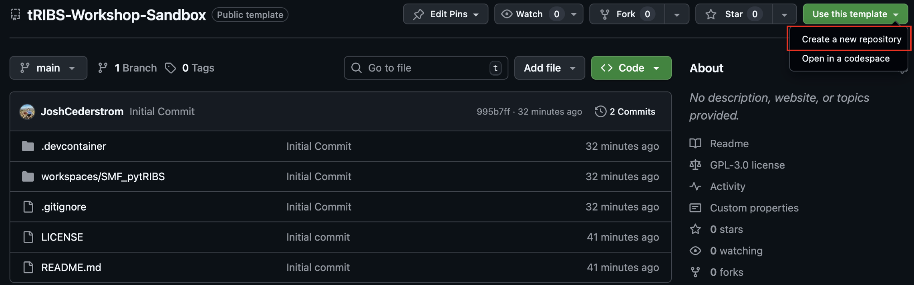
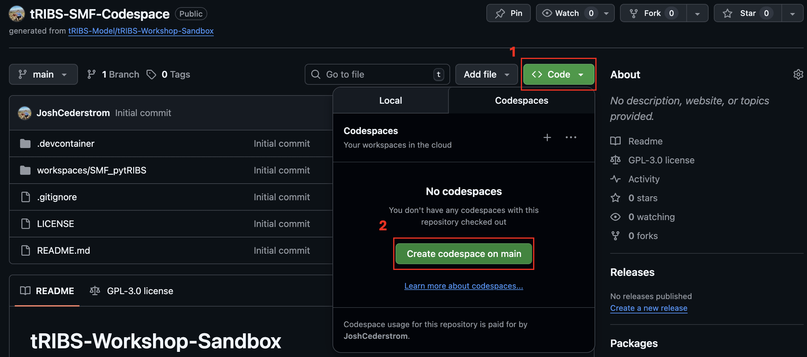

# tRIBS Workshop Sandbox

Welcome to the **tRIBS (TIN-based Real-time Integrated Basin Simulator)** interactive environment. This repository provides a cloud-native, zero-install "Sandbox" for running distributed hydrologic simulations with tRIBS. 

This environment is designed for **GitHub Codespaces** to provide a pre-configured Linux environment with all C++ dependencies, the tRIBS model engine, and the `pytRIBS` Python library ready for use.

---

## Quick Start: Launching the Sandbox

You do not need to install anything on your local machine. Follow these steps to launch the model in your browser:

### 1. Create a Github Account
A GitHub account is required to use Codespaces. 

### 2. Create your own Sandbox
Click the green **"Use this template"** button at the top of this page and select **"Create a new repository."** This gives you a private copy to save your work to your own GitHub account. When prompted, give the repository a name like "tRIBS-SMF-Codespace" for tRIBS South Mountain Fan Codespace.

### 3. Launch Codespaces
In your new repository, click the green **"<> Code"** button, select the **"Codespaces"** tab, and click **"Create codespace on main."**

### 4. Open the Notebook
Once the environment loads (this may take 4-5 minutes the first time), open the `workspaces/` folder and click on the workshop notebook (e.g., `pytRIBS_SMF.ipynb`). Once the Jupyter Notebook is opened the Codespace will recognize that you want to use Jupyter and will download some additional files to the Codespace. The Codespace is an in-browser version of Microsoft's VScode that can be used to run the example notebook to setup and run the tRIBS model for the South Mountain Fan Watershed.

---

## What’s Inside?

This sandbox is pre-loaded with:
*   **The tRIBS Model Engine:** A fully compiled C++ executable of the TIN-based Real-time Integrated Basin Simulator.
*   **pytRIBS:** Our Python API for pre-processing terrain data, managing simulations, and visualizing results.
*   **Sample Data:** A 5 $km^2$ high-resolution watershed dataset (DEM, Soil, and Land Use) ready for simulation.
*   **Computational Environment:** A Debian-based Linux environment with Python 3.11, CMake, and all necessary spatial libraries.

---

## Educational Objectives

In this sandbox, you will  explore **physically-based distributed hydrology** using tRIBS:
1.  **TIN Generation:** Learn how Voronoi polygons represent watershed complex topography more efficiently than grids.
2.  **Parameterization:** Adjust soil hydraulic properties and vegetation parameters (Interception, ET).
3.  **Simulation:** Run the model and observe states evolve across the landscape.
4.  **Analysis:** Visualize surface-subsurface interactions and simulated hydrograph responses to the August 2014 flow event at South Mountain Fan.

---

## 🛠 Troubleshooting

*   **Kernel Not Found:** If prompted for a kernel, select **"Python 3.11.x"** (the Recommended version).
*   **Model Build Issues:** If `!tRIBS` does not return a help message in the notebook, try rebuilding the container:
    1. Press `Ctrl+Shift+P` (Windows) or `Cmd+Shift+P` (Mac).
    2. Type **"Codespaces: Rebuild Container"** and press Enter.
*   **Storage:** Large simulation results are ignored by Git to keep the repo fast. Be sure to save your plots (PNGs) if you need them for your report!

---
